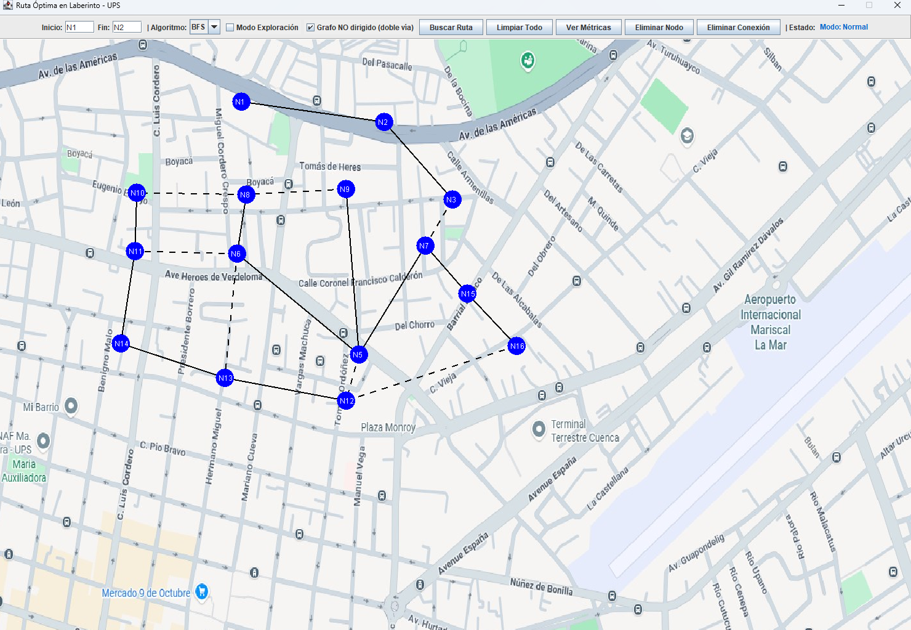
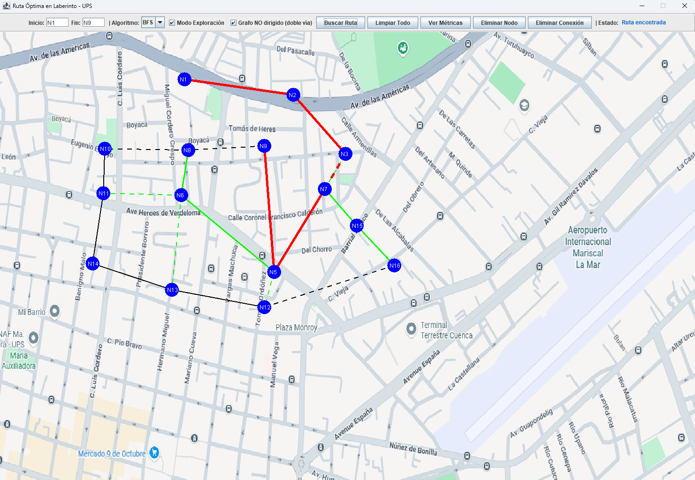

#  Proyecto Final – Estructura de Datos  
## Sistema Interactivo de Exploración de Grafos con BFS y DFS  

### Universidad Politécnica Salesiana  
**Materia:** Estructura de Datos  

**Carrera:** Computación  

**Estudiante:** Andrés Tenesaca, Erika Collaguazo  

**Docente:** Pablo Torres  

**Periodo:** Segundo 

**Correo institucional:** jtenesacac4@est.ups.edu.ec, ecollaguazom@est.ups.edu.ec 

---

#  1. Introducción

El presente proyecto tiene como objetivo aplicar los conocimientos adquiridos en la asignatura de **Estructura de Datos**, mediante la implementación práctica de un sistema interactivo para la construcción y exploración de grafos.

Se desarrolla una aplicación en Java que permite modelar un mapa visual como un grafo dinámico, donde los usuarios pueden crear nodos, establecer conexiones dirigidas o no dirigidas, y ejecutar algoritmos de búsqueda para encontrar rutas óptimas entre dos puntos.

El sistema integra visualización gráfica, persistencia de datos y registro de métricas, fortaleciendo la comprensión de los algoritmos BFS y DFS en un entorno práctico.

---

#  2. Descripción del Problema

En muchos sistemas reales (GPS, redes de comunicación, videojuegos, transporte urbano), es necesario encontrar rutas entre diferentes puntos conectados.

El problema consiste en:

- Representar un mapa como un **grafo**.
- Permitir la configuración dinámica de nodos y conexiones.
- Implementar algoritmos de búsqueda.
- Visualizar el proceso de exploración.
- Comparar el comportamiento de BFS y DFS.

El sistema no solo muestra la ruta final encontrada, sino también el proceso completo de exploración, lo que permite un análisis comparativo del funcionamiento interno de cada algoritmo.

---

#  3. Marco Teórico

##  3.1 Grafos

Un **grafo** es una estructura de datos compuesta por:

- **Vértices (nodos)**: representan entidades.
- **Aristas (edges)**: representan conexiones entre nodos.

Formalmente, un grafo se define como:

G = (V, E)

Donde:
- V es el conjunto de vértices.
- E es el conjunto de aristas.

---

##  3.2 BFS (Breadth First Search)

El algoritmo BFS:

- Utiliza una **cola (Queue)**.
- Recorre el grafo por niveles.
- Garantiza encontrar el **camino más corto en grafos no ponderados**.
- Tiene complejidad: O(V + E)

Características:

- Exploración sistemática.
- Ideal para rutas mínimas.
- Mayor consumo de memoria que DFS.

---

##  3.3 DFS (Depth First Search)

El algoritmo DFS:

- Utiliza recursividad o una pila (Stack).
- Explora profundamente antes de retroceder.
- No garantiza el camino más corto.
- Complejidad: O(V + E)

Características:

- Menor consumo de memoria en ciertos casos.
- Útil para detección de ciclos.
- Genera recorridos profundos.

---

#  4. Tecnologías Utilizadas

- Java  
- Swing (Interfaz gráfica)  
- HashMap  
- List  
- Set  
- Queue  
- Patrón MVC  
- Persistencia en archivos (.txt)  
- Registro de métricas en CSV  
- Programación Orientada a Objetos (POO)  

---

#  5. Arquitectura del Sistema (MVC)

El proyecto implementa el patrón **Modelo–Vista–Controlador**, lo que permite una correcta separación de responsabilidades.

| Capa | Responsabilidad |
|------|-----------------|
| Model | Representación del grafo, nodos, aristas y algoritmos BFS/DFS |
| Controller | Gestión de ejecución de búsquedas y conexión entre vista y modelo |
| View | Interfaz gráfica y visualización del grafo |
| Util | Persistencia y registro de métricas |

Esta arquitectura garantiza:

- Bajo acoplamiento  
- Alta cohesión  
- Escalabilidad  
- Mantenimiento sencillo  

---

#  6. Diagrama UML del Proyecto

El siguiente diagrama representa la arquitectura completa del sistema, mostrando:

- Separación por paquetes  
- Relaciones entre clases  
- Aplicación del patrón MVC  
- Implementación de BFS y DFS  


El diagrama evidencia una correcta distribución de responsabilidades y una implementación modular del sistema.

---

#  7. Estructura del Proyecto

# Estructura del Proyecto

A continuación se detalla la organización de directorios y archivos del código fuente y los recursos de datos.

##  Directorios

###  Código Fuente (`src/`)

El proyecto sigue un patrón de diseño **MVC (Modelo-Vista-Controlador)** para mantener una separación clara de responsabilidades:

* **`model/`**: Contiene la lógica de negocio y las estructuras de datos fundamentales.
    * `Graph.java`: Estructura principal del grafo.
    * `Node.java` & `Edge.java`: Componentes básicos del grafo.
    * `SearchResult.java`: Objeto para almacenar los resultados de las búsquedas.
    * `VisitedEdge.java`: Registro de aristas recorridas.
* **`controller/`**: Actúa como puente entre la vista y el modelo.
    * `GraphController.java`: Maneja los eventos y la lógica de flujo.
* **`view/`**: Contiene la interfaz gráfica de usuario (Swing).
    * `MainFrame.java`: Ventana principal de la aplicación.
    * `MapPanel.java`: Panel especializado para renderizar el mapa y el grafo.
    * `MetricsFrame.java`: Ventana para la visualización de datos y métricas.
* **`util/`**: Herramientas de apoyo y utilidades.
    * `PersistenceManager.java`: Gestión de lectura/escritura de archivos.
    * `MetricsLogger.java`: Registro y seguimiento de tiempos y rendimiento.
* **`App.java`**: Punto de entrada principal de la aplicación.

---

###  Datos y Recursos (`data/`)

Archivos externos utilizados para la configuración y persistencia:

* `mapa.jpg`: Imagen de fondo utilizada en la interfaz.
* `config_grafo.txt`: Archivo de configuración para cargar los nodos y aristas.
* `tiempos_ejecucion.csv`: Registro histórico de las métricas de rendimiento.

---

##  Árbol de Directorios

```text
src/
├─ model/
│  ├─ Graph.java
│  ├─ Node.java
│  ├─ Edge.java
│  ├─ SearchResult.java
│  └─ VisitedEdge.java
├─ controller/
│  └─ GraphController.java
├─ view/
│  ├─ MainFrame.java
│  ├─ MapPanel.java
│  └─ MetricsFrame.java
├─ util/
│  ├─ PersistenceManager.java
│  └─ MetricsLogger.java
└─ App.java

data/
├─ mapa.jpg
├─ config_grafo.txt
└─ tiempos_ejecucion.csv


```
---

#  8. Funcionamiento General del Sistema

1. Se cargan nodos y conexiones desde archivo.  
2. El usuario puede crear nodos haciendo clic izquierdo.  
3. Puede conectar nodos con clic derecho.  
4. Se selecciona el algoritmo (BFS o DFS).  
5. Se ejecuta la búsqueda entre nodo inicio y destino.  
6. Se visualiza:
   - Exploración progresiva  
   - Ruta final encontrada  
7. Se registra el tiempo de ejecución en un archivo CSV.  

---

#  9. Capturas de la Interfaz

## 🔹 Creación de nodos y conexiones



## 🔹 Ejecución de BFS en modo exploración



---

#  10. Ejemplo de Implementación – BFS

```java
queue.add(start);
visited.add(start);

while (!queue.isEmpty()) {
    Node current = queue.poll();

    for (Node neighbor : adjList.get(current)) {
        if (!visited.contains(neighbor)) {
            visited.add(neighbor);
            parentMap.put(neighbor, current);
            queue.add(neighbor);
        }
    }
}
```
Este algoritmo garantiza encontrar el camino más corto en grafos no ponderados debido a su exploración por niveles.

---

#  11. Ejemplo de Implementación – DFS

A continuación se presenta una implementación simplificada del algoritmo DFS utilizando recursividad:

```java
public void dfs(Node current, Node target, Set<Node> visited, Map<Node, Node> parentMap) {
    visited.add(current);

    if (current.equals(target)) {
        return;
    }

    for (Node neighbor : adjList.get(current)) {
        if (!visited.contains(neighbor)) {
            parentMap.put(neighbor, current);
            dfs(neighbor, target, visited, parentMap);
        }
    }
}
```

En esta implementación:

- Se utiliza un `Set<Node>` para evitar visitar nodos repetidos.
- Se emplea un `Map<Node, Node>` para reconstruir el camino final.
- El algoritmo explora profundamente cada rama antes de retroceder.

A diferencia de BFS, DFS no garantiza el camino más corto, ya que puede explorar una rama extensa antes de encontrar el destino.

---

#  12. Reconstrucción del Camino Encontrado

Tanto en BFS como en DFS, el camino final se reconstruye utilizando el mapa de padres (`parentMap`):

```java
List<Node> path = new ArrayList<>();
Node step = target;

while (step != null) {
    path.add(step);
    step = parentMap.get(step);
}

Collections.reverse(path);
```

Este procedimiento permite obtener la secuencia ordenada desde el nodo inicial hasta el nodo destino.

---

#  13. Análisis de Complejidad

Ambos algoritmos presentan la misma complejidad temporal:

- **Complejidad temporal:** O(V + E)  
- **Complejidad espacial:** O(V)  

Donde:

- V = número de vértices  
- E = número de aristas  

Sin embargo, su comportamiento práctico difiere en:

- Uso de memoria  
- Orden de exploración  
- Garantía de optimalidad  

---

#  14. Comparación Experimental BFS vs DFS

| Característica | BFS | DFS |
|---------------|-----|-----|
| Estructura usada | Queue | Recursión / Stack |
| Camino más corto | Sí | No |
| Orden de exploración | Por niveles | Profunda |
| Uso de memoria | Mayor | Menor |
| Ideal para | Rutas óptimas | Exploración profunda |
| Comportamiento visual | Expansión uniforme | Expansión en ramas |

En pruebas realizadas con distintos grafos:

- BFS mostró tiempos ligeramente mayores en grafos extensos debido al almacenamiento por niveles.
- DFS fue más rápido en grafos pequeños o poco ramificados.
- BFS siempre encontró la ruta más corta cuando existía.

---

#  15. Registro de Métricas

El sistema implementa un módulo de registro de métricas mediante la clase `MetricsLogger`.

Se registran los siguientes datos:

- Algoritmo utilizado  
- Nodo inicial  
- Nodo destino  
- Tiempo de ejecución (nanosegundos)  
- Número de nodos visitados  

Ejemplo de registro en CSV:

```
Algoritmo,Inicio,Destino,Tiempo(ns),NodosVisitados
BFS,A,F,245600,8
DFS,A,F,198300,10
```

Esto permite realizar comparaciones objetivas entre ambos algoritmos y analizar su rendimiento.

---

#  16. Ventajas del Diseño Implementado

✔ Separación clara de responsabilidades (MVC)  
✔ Código modular y escalable  
✔ Persistencia de datos externa  
✔ Visualización gráfica interactiva  
✔ Registro automático de métricas  
✔ Fácil extensión para futuros algoritmos  

---

#  17. Posibles Mejoras Futuras

El sistema puede ampliarse con:

- Implementación de grafos ponderados  
- Algoritmo de Dijkstra  
- Algoritmo A* (A Star)  
- Interfaz mejorada con animaciones avanzadas  
- Exportación de resultados en PDF  
- Uso de base de datos en lugar de archivos planos  
- Simulación comparativa automática entre algoritmos  

---

#  18. Instrucciones de Ejecución

1. Clonar el repositorio:

```
git clone https://github.com/andres469/icc_est_ProyectoFinal.git
```

2. Abrir el proyecto en un IDE compatible con Java (NetBeans, IntelliJ, Eclipse).

3. Verificar que la carpeta `data/` esté presente.

4. Ejecutar el archivo principal:

```
App.java
```

5. Seleccionar el algoritmo y probar la búsqueda entre nodos.

---

#  19. Conclusiones
### Conclusión personal – Andrés Tenesaca
El desarrollo de la presente práctica y del proyecto final permitió fortalecer de manera significativa mis conocimientos en estructuras de datos, especialmente en el manejo de grafos y algoritmos de búsqueda como BFS y DFS. A través de la implementación práctica en Java, comprendí el funcionamiento interno de estructuras como HashMap, Queue, Set, listas dinámicas y su integración dentro de un sistema organizado bajo el patrón MVC.

El desarrollo de este proyecto permitió aplicar de manera práctica los conceptos fundamentales de estructuras de datos, específicamente grafos y algoritmos de recorrido.

Se logró:

- Implementar correctamente BFS y DFS.  
- Visualizar gráficamente la exploración de nodos.  
- Comparar experimentalmente el rendimiento de ambos algoritmos.  
- Aplicar el patrón MVC de forma estructurada.  
- Integrar persistencia y registro de métricas.  

BFS demostró ser más adecuado cuando se requiere el camino más corto, mientras que DFS resulta útil para exploraciones profundas y análisis estructurales del grafo.

El proyecto consolida el aprendizaje teórico mediante una implementación funcional, modular y extensible.

---

#  20. Aplicaciones Reales

Los conceptos implementados en este sistema tienen aplicación directa en:

- Sistemas GPS  
- Planificación de rutas logísticas  
- Redes de comunicación  
- Videojuegos  
- Inteligencia Artificial  
- Sistemas de recomendación  
- Análisis de redes sociales  
- Motores de búsqueda  

---

